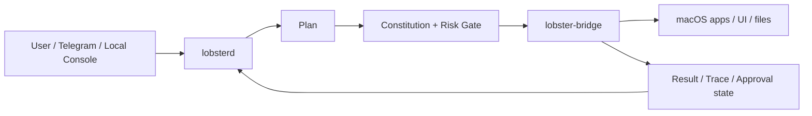

# Lobster Architecture

## System Overview

Lobster is split into three runtime pieces:

- `lobster-app`: the desktop operator surface for viewing runs, approvals, and state
- `lobsterd`: the TypeScript orchestration daemon that routes tasks, models, approvals, and persistence
- `lobster-bridge`: the Swift macOS bridge that performs real desktop interaction

The control path is intentionally narrow. User intent enters through chat or the local console, gets turned into a task, passes policy checks, then reaches the bridge only when the action is allowed.

## Execution Loop

Lobster uses a fixed loop so the agent does not jump straight from text to action:

1. `Observe`
2. `Plan`
3. `Self-Check`
4. `Risk Gate`
5. `Act`
6. `Verify`
7. `Recover`

The loop is important because desktop automation is brittle. Every action should be based on visible state, not on assumptions.

## Responsibilities

### `lobster-app`

- Shows task status, approvals, and local operator data
- Provides a human-facing view into runs and staged skills
- Helps with review and observability rather than automation itself

### `lobsterd`

- Accepts task input from chat and local commands
- Chooses models and strategies
- Applies constraints and approval rules
- Manages storage, inboxes, and execution state

### `lobster-bridge`

- Talks to `Accessibility`, `Screen Recording`, and related macOS APIs
- Finds apps, windows, controls, and text
- Performs clicks, typing, scrolling, app activation, and file interaction
- Returns observed state and action results back to the daemon

## Policy Model

Lobster separates intent from permission:

- `green`: low-risk and auto-executable
- `yellow`: allowed, but requires stronger verification and one-time approval
- `red`: blocked and never bypassed

The policy layer exists so the model cannot directly override safety. The daemon and bridge both enforce it.

## Data Flow

1. A user message or notification becomes a task.
2. The orchestrator normalizes the request and picks a strategy.
3. The model proposes a plan or action draft.
4. The policy engine classifies the action.
5. Approved actions reach the native bridge.
6. Results are recorded for replay, debugging, and follow-up.

## Evolution Flow

Lobster can turn successful traces into future capabilities, but only within guardrails:

1. Mine traces from runs that already happened.
2. Derive a declarative workflow, prompt pack, or composition template.
3. Replay the candidate in a sandbox.
4. Classify the risk level.
5. Auto-promote only low-risk declarative candidates.
6. Send everything else to manual review.

## What This Means In Practice

- The system is designed to operate like a careful assistant, not an unrestricted macro runner.
- The bridge is intentionally dumb and narrow.
- The daemon is where the policy, orchestration, and model routing live.
- The UI is there for visibility and intervention, not for bypassing approval.
